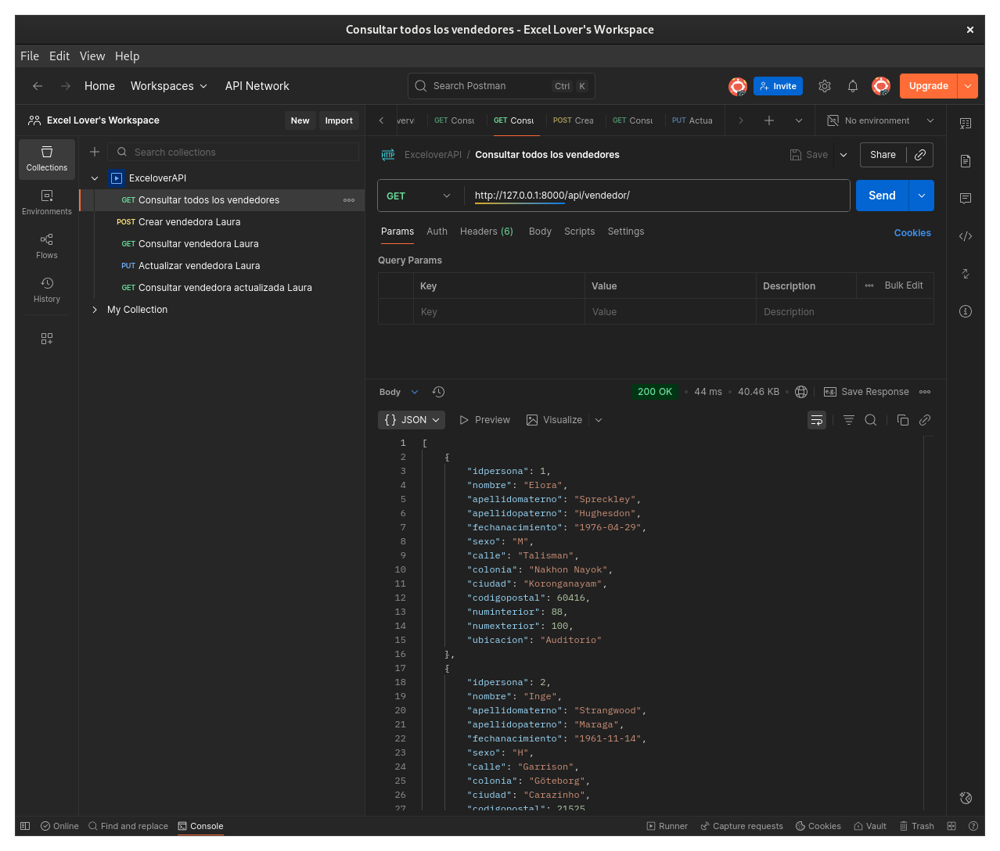

# Pasos para probar el proyecto

Posicionarse en `Práctica08_excelovers/SRC/Proyecto/exceloversdb`

1. Crear entorno virtual
```sh
python3 -m venv venv
source venv/bin/activate
pip install -r requirements.txt
```

2. Levantar base de datos PostgreSQL con Docker
```sh
docker rm -f excelovers

docker run --name excelovers \
-e POSTGRES_USER=excelovers_user \
-e POSTGRES_PASSWORD=excelovers_123 \
-e POSTGRES_DB=excelovers_db \
-p 5432:5432 \
-d postgres
```

3. Cargar estructura y datos de la base
```sh
docker cp ../../../SQL/DDL.sql excelovers:/DDL.sql
docker cp ../../../SQL/DML.sql excelovers:/DML.sql
```
```sh
docker exec -it excelovers bash
psql -U excelovers_user -d excelovers_db
\i /DDL.sql;
\i /DML.sql;
\q
exit
```
4. Aplicar migraciones y crear superusuario
```sh
python manage.py makemigrations
python manage.py migrate
python manage.py createsuperuser
```
```sh
Username: excelover
Email: exceloverss@gmail.com
Password: LAXJAg$r4
```
5. Levantar el servidor
```sh
python manage.py runserver
```

6. Iniciar Postman con la cuenta:
   
- Email: exceloverss@gmail.com
- Password: LAXJAg$r4 

y probar la API con las url's:

- http://127.0.0.1:8000/api/vendedor/
- http://127.0.0.1:8000/api/alimento/
- http://127.0.0.1:8000/api/vendedor/(id)
- http://127.0.0.1:8000/api/alimento/(id)


# * Instalar Postman

Descargar en [Postman](https://www.postman.com/downloads/)

```sh
sudo tar -xzf postman-linux-x64.tar.gz -C /opt
sudo ln -s /opt/Postman/Postman /usr/bin/postman
```

Iniciar postman
```sh
postman
```
Probar Api
